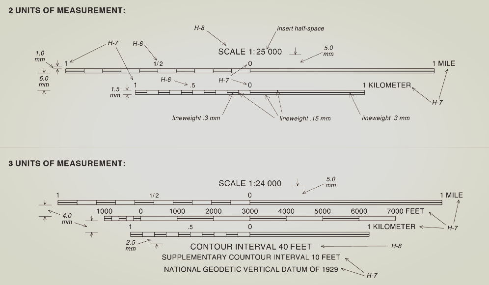
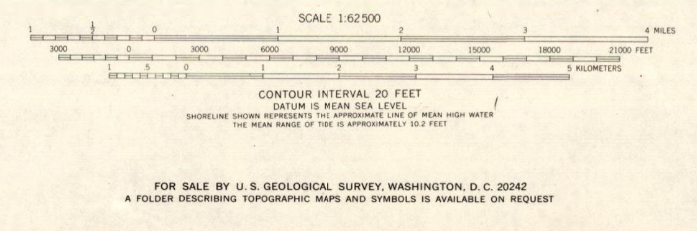
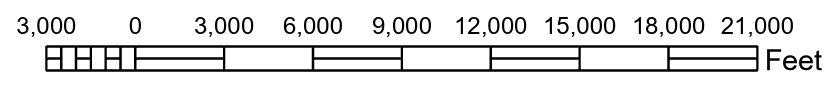
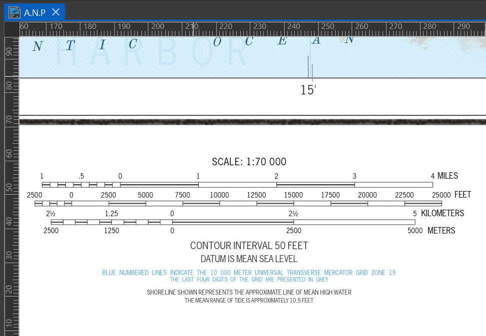

## Quick Summary

This article explores how to recreate historical scale bars in ArcGIS Pro using a 1960s topographic map of Mount Desert Island and Acadia National Park as a visual reference.

It covers scale-bar divisions and subdivisions, typographic control, symbol hierarchy, line weights, conversion to graphics, and the small design decisions that help modern layouts reflect historical USGS cartographic conventions.

## Introduction

I have recently been working on a custom cartographic layout in ArcGIS Pro, referencing a 1960s topographic map of [Mount Desert Island, Acadia National Park](https://www.loc.gov/resource/g3732a.np000044/?r=-0.028,0.687,0.999,0.457,0). My goal was to faithfully recreate the look (for sure) & feel (maybe not yet there) of historical scale bars, specifically guided by the [U.S. Geological Survey Open-File Report 99-430: Digital Cartographic Standard for Geologic Map Symbolization](https://www.fgdc.gov/standards/projects/geo-symbol/FGDC_swg_DigCartoStd-all.pdf).

*Figure 1. U.S. Geological Survey Open-File Report 99-430: Digital Cartographic Standard for Geologic Map Symbolization.*

## Historical Reference and Design Context

> In ArcGIS Pro, recreating historical map styles isn’t always straightforward, but it’s definitely possible with the right attention to detail.

*Figure 2. The referenced scale bars of the Acadia National Park and Vicinity, Hancock Co., Maine (G372.A3 1971 .U6) map.*

One of the first things I had to consider was understanding the end look. I mean, looks aren’t everything unless you're a map trying to pass as vintage. Anyways, before building anything, I took time to analyze the original scale bar, paying attention to the map unit, scale ratio, bar style, and line weights. These set the foundation for the rest of the design.

## ArcGIS Pro Workflow Setup

After the understanding, we get into the ArcGIS Pro environment. We are expected to have created a map and added it to a layout. With an Alternating Scale Bar added, we start setting the divisions and subdivisions. Choosing the length of the scale bar and how it's broken down into divisions and subdivisions is critical. These choices define the rhythm and accuracy of the scale.

*Figure 3. Scale bar in ArcGIS Pro before editing.*

## Labeling and Typographic Control

I also had to think carefully about the labels. It's not just placing those numbers. You need to decide on their frequency and position. Details such as the font type and size play a key role in matching with your historical reference.

> **Important**
>
> Typography and spacing decisions determine how closely the reconstructed scale bar matches historical USGS conventions. These are not decorative choices.

## Symbol Design and Visual Hierarchy

Then there's the symbol style and the presence (or absence) of marks. You’d think adding more elements makes a design more informative, but sometimes, it’s what you leave out that says the most. I like to think of it as cartographic restraint: the quiet confidence of a scale bar that doesn’t need every tick to prove its point.

ArcGIS Pro offers options like Hollow, Alternating, and Double Alternating bars. In my case, I went with a hollow bar and left out the division marks entirely, not by accident, but by design. It was a deliberate nod to the original map’s understated elegance.

To match the scale with the reference, I paid attention to the scale bar height and line weight properties. The [U.S. Geological Survey Open-File Report 99-430: Digital Cartographic Standard for Geologic Map Symbolization](https://www.fgdc.gov/standards/projects/geo-symbol/FGDC_swg_DigCartoStd-all.pdf) guide was helpful. In the final design, the mid-alternating lines have a heavier line weight of 0.3 mm, while the outer ones are lighter at 0.15 mm.

> **Tip**
>
> Line weight contrast is what separates readable historical replicas from modern defaults. Keep hierarchy explicit.

## Converting Scale Bars to Graphics

One crucial step, and it actually comes before fine-tuning line weights, is converting the scale bar to graphics. Until you do that, making precise adjustments can be a bit tricky. Once converted, you gain full editing control, allowing you to independently tweak elements like bars, text, and lines.

> **Note**
>
> Editing precision in ArcGIS Pro scale bars only becomes fully available after conversion to graphics. Before this step, symbol components remain constrained by the scale bar object model.

*Figure 4. This is a sample of the scale bar layout achieved through the process described above.*

## External References and Validation

For anyone diving into this, John Nelson's two-part tutorial on creating vintage-style scale bars in ArcGIS Pro is a great starting point.

> **See Also**
>
> The scale bar structure was validated using a historical USGS-era map of [Mount Desert Island and Acadia National Park](https://www.loc.gov/resource/g3732a.np000044/).
>
> John Nelson’s ArcGIS Pro tutorials:
>
> 1. Part 1: [Vintage Scale Bars](https://www.youtube.com/watch?v=eJPHQCGjvuQ&feature=youtu.be&themeRefresh=1)
>
> 2. Part 2: [Advanced Styling](https://www.youtube.com/watch?v=eTQTvP7QqfA)

## Conclusion

Should we end it here? Let’s call this the last tick on the bar. It’s been incredibly rewarding to see everything start to click. Truly, the future of cartography lies in its past, and modern software is the medium that lets us connect with that past. If you’re working on vintage cartographic reproductions or exploring geovisual storytelling, feel free to reach out. I’m always happy to trade ideas or geek out over maps.

## Acknowledgements

This work draws on USGS cartographic standards and ArcGIS Pro documentation.
