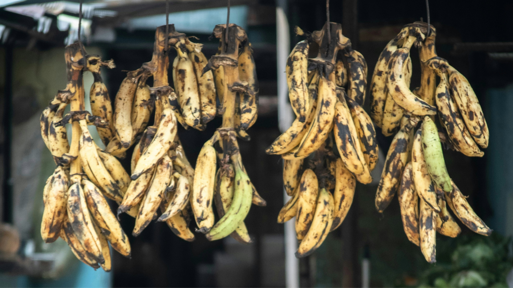
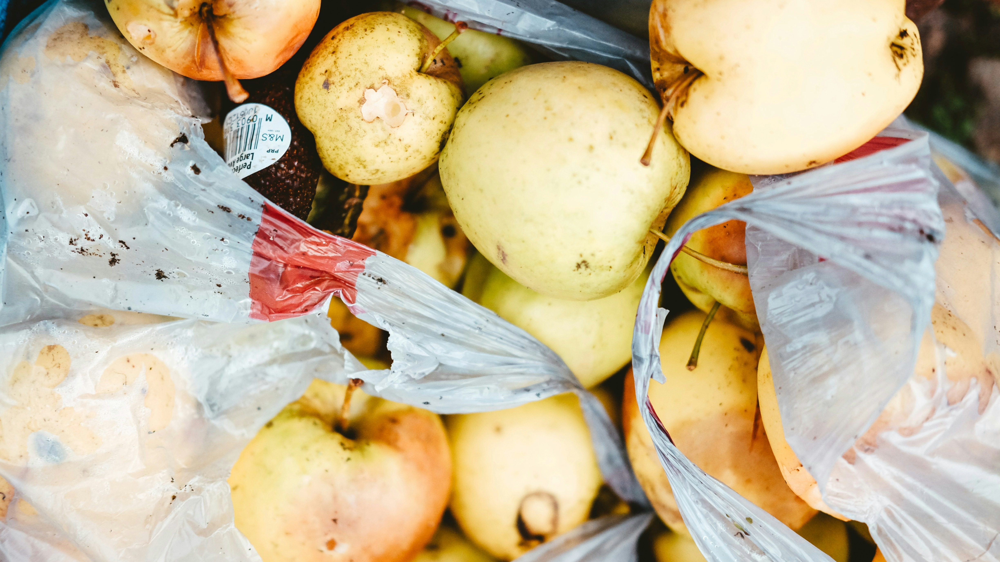
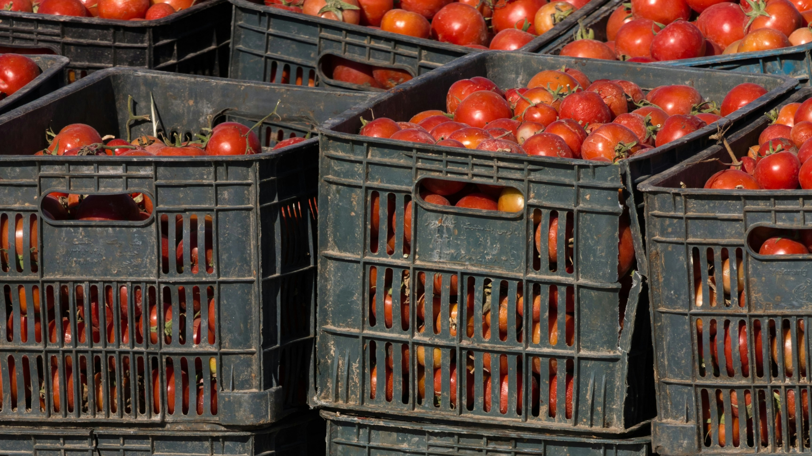
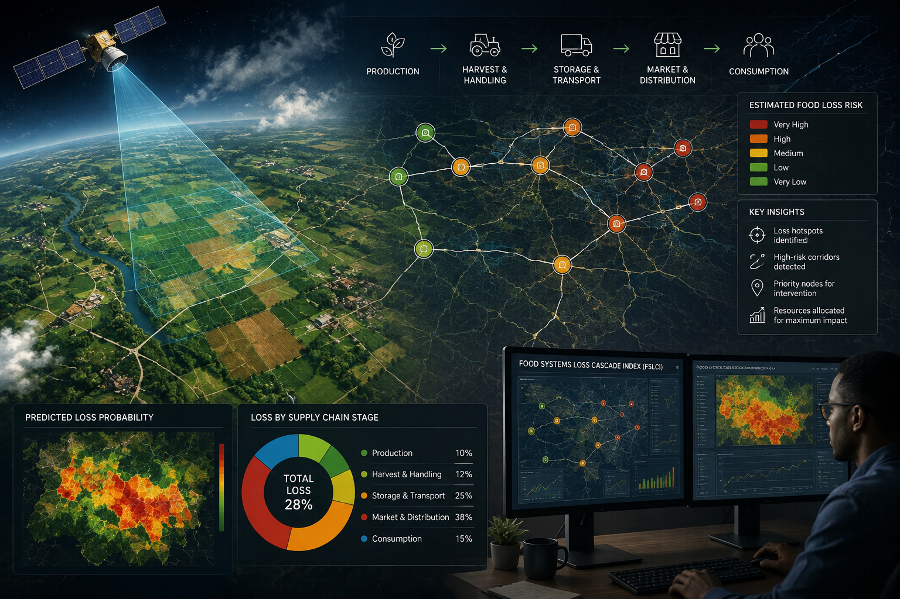

## Quick Summary

Food loss and waste is usually measured through national and regional totals. This article argues that those totals do not reveal where losses begin, how they accumulate across supply chains, or where interventions will have the greatest effect.

It explores how geospatial analysis, remote sensing, GIS, machine learning, and artificial intelligence can make food loss and waste spatially visible, supporting better monitoring, investment, and governance from farm to market.

## The Scale of a Crisis We Are Not Yet Governing Well

A report by [UNEP (2024)](https://www.unep.org/resources/publication/food-waste-index-report-2024) indicates that nearly 19% (equivalent of 1.05 billion tonnes) of all food available to all consumers at the retail, food service and household levels is wasted globally and about 13% (equivalent of 1.25 billion tonnes) of food produced is lost between harvest and retail (FAO, 2023). Let these figures sink in for a moment: nearly one in five portions of food produced for human consumption never reaches a human being. At the same time, this has a huge food insecurity impact to about 28% population (2.3 billion people) globally (FAO et al., 2025). Bringing this closer home, [WRI Africa (2025)](https://www.wri.org/insights/how-much-food-does-the-world-waste) reports that Kenya loses up to 40% (about 9 million tons) of the food produced each year, which translates to food worth about 578 million USD. The coexistence of these two realities is not a paradox of scarcity. It is a paradox of systems gap and failure.

*Figure 1. Food loss can become visible at market level when produce deteriorates before it is sold or consumed. Photo: Carlos Torres / Unsplash.*

The World Bank’s recent [“What a Waste 3.0 report (2026)”](https://hdl.handle.net/10986/44141) places food waste in plain structural context: food waste is now the single largest category of municipal solid waste globally, accounting for approximately 38% of all solid waste amounting to nearly one billion tonnes per year. In low-income countries, this proportion rises to nearly 50% of all waste generated. This is not simply an environmental statistic. It is a governance signal that cannot be ignored: the systems we have built to produce, move, and distribute food are losing nearly a fifth of what they generate, and the burden of that loss falls most heavily on the countries and communities least equipped to absorb it.

The climate dimension compounds the urgency. Food loss and waste (FLW) contributes an estimated 8 to 10% of total global greenhouse gas emissions (FAO, 2024). Reducing food waste has been identified as one of the most impactful climate solutions available ([UNEP, 2024](https://www.unep.org/resources/publication/food-waste-index-report-2024)). Yet, progress toward SDG Target 12.3 which calls for halving per capita food waste at retail and consumer levels while reducing food losses along production and supply chains by 2030, remains deeply off-track.

## What the Data Does Not Yet Tell Us: The Spatial Blindspot

The data on food loss and waste is sobering. What is equally sobering is what the data does not yet show us. Current food loss measurement frameworks; including FAO’s Food Loss Index (SDG sub-indicator 12.3.1a) and [UNEP’s Food Waste Index](https://www.unep.org/resources/publication/food-waste-index-report-2024), operate at national and regional aggregate scales (country or region). We have a blurry picture of where along the supply chain the loss is occurring, which corridors between farm and market are generating the greatest losses, or which market nodes are the critical intervention points.

*Figure 2. Discarded fruit reflects losses that may occur across handling, retail, and household systems. Photo: Nik / Unsplash.*

This spatial blindspot has real governance consequences. The [World Bank (2026)](https://hdl.handle.net/10986/44141) documents three of the world’s most sophisticated food waste governance systems, Japan’s Food Waste Recycling Law, Massachusetts’ commercial organics disposal ban, and China’s kitchen waste regulatory framework. All three rely on mandatory reporting by volume, facility permits, or digital ledger systems. None of them are spatial. Governments know how much food waste is being generated. They do not know where the loss cascade begins, how it amplifies along supply chains, or where targeted intervention would deliver the greatest reduction per unit of investment.

WRI Africa's (2025) three-pronged approach rightly prioritizes data and monitoring as the first line of action, yet the recommended systems remain aspatial. Knowing that Kenya loses up to 56% of fresh fruits tells us the scale; it does not tell us which corridors between farms and markets are generating the greatest losses, or where targeted cold chain investment would yield the highest return. Without spatial disaggregation, even the best monitoring systems risk directing interventions to the wrong places (FAO, 2019; [World Bank, 2026](https://hdl.handle.net/10986/44141)).

*Figure 3. Transport crates and market flows are part of the spatial infrastructure through which food loss accumulates or can be prevented. Photo: Matin Tavazoei / Unsplash.*

I understand that FLW is not evenly distributed across the supply chain, it clusters at nodes of infrastructural deficiency, concentrates along poorly connected transport corridors, and intensifies at markets with weak governance. It is, fundamentally, a spatial problem, and spatial problems cannot be governed by aggregate statistics alone. They require spatially explicit evidence that tells decision-makers not just how much is being lost, but precisely where, why, and at whose expense.

## How Geospatial Analysis, Machine Learning, and AI Can Help

Geospatial analysis, remote sensing, machine learning, and artificial intelligence offer a transformative complement to the conventional FLW toolkit. Where existing methods tell us the scale of loss, these tools tell us the location, the cause, and the trajectory.

At the production level, remote sensing can detect crop stress, harvest delays, and field abandonment through satellite-derived vegetation index time series, providing wall-to-wall, temporally continuous indicators of on-farm food loss at landscape scale. At the supply chain level, GIS network analysis can model the spatial topology of food supply chains, mapping roads, handling nodes, storage facilities, and market hubs, and ML models can construct loss probability surfaces that identify which segments of the chain are generating the greatest post-harvest losses and why. At the market level, AI-driven demand forecasting models can predict where and when market waste will spike, enabling advance intervention before food is discarded.

*Figure 4. A conceptual Food Systems Loss Cascade Index combining remote sensing, supply-chain networks, loss-risk modelling, and priority intervention nodes. AI-generated editorial illustration for The Kalabash Mosaics.*

Integrated, these tools can produce a Food Systems Loss Cascade Index (FSLCI), a spatially explicit, supply-chain-wide index that maps the geography of food loss and waste risk from farm to market. Such an index would provide SDG 12.3 monitoring with the spatial disaggregation, and would give planners, investors, and policymakers and other industry experts the evidence they need to direct interventions to the nodes where they will have the greatest impact.

## Call to Action: Making FLW Spatially Visible

My argument is that we cannot govern what we cannot see and we cannot see food loss until we make it spatial. The aggregate numbers are sobering enough but the path from awareness to action runs through evidence, and the evidence we most urgently need is not just how much food is being lost, but where, why, and at what cost to which communities.

The [World Bank (2026)](https://hdl.handle.net/10986/44141) is right that food waste is one of the most complex issues facing the world today. But complexity is not an argument for inaction. It is an argument for better tools and methods. More than before, the data infrastructure to deploy them is increasingly available: satellite imagery, road network data, market prices data, and supply chain records exist for most of the world’s major agricultural systems. What is needed now is the research investment, the institutional will, and the interdisciplinary collaboration to deploy them at scale.

Food loss and waste is a spatial problem. It is time we looked at it from above and acted from the ground up.
