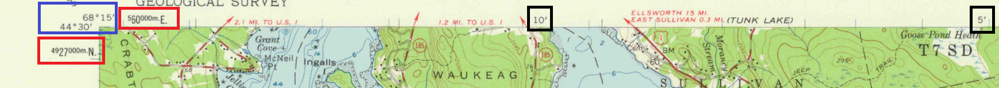
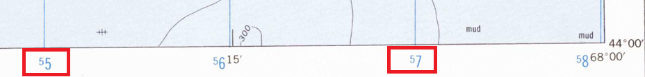
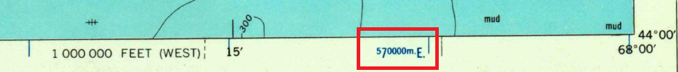
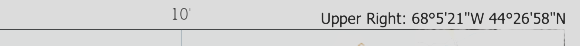
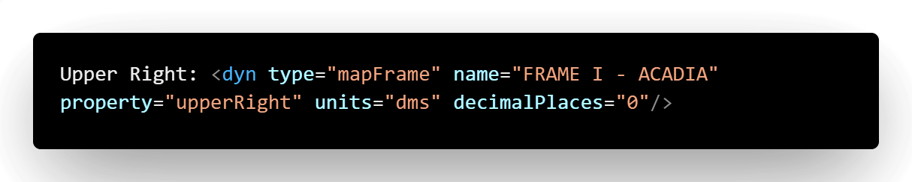
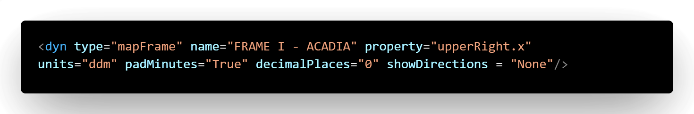
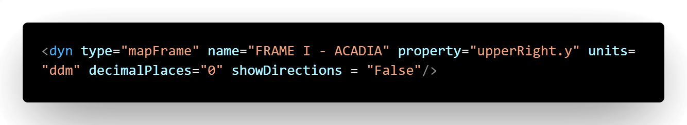
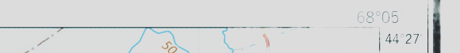
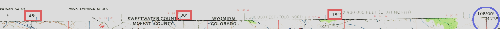
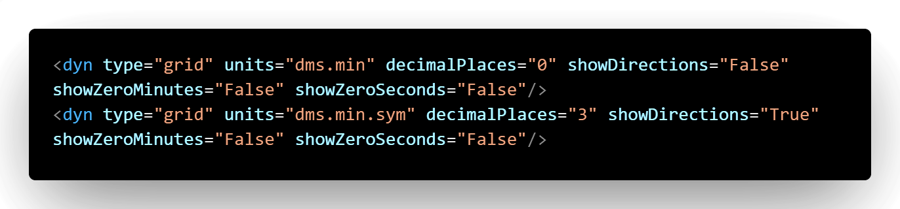

*Progredimur, cum disciplina, agimus — We move forward, learning, we do.*

## Quick Summary

This article explains how to recreate the corner coordinates and graticule styling commonly found on historical topographic maps using ArcGIS Pro.

You will work with Dynamic Text, coordinate formatting, minute padding, intermediate minute markers, and the visual conventions that distinguish classic topo maps from modern software defaults.

## What You Will Learn

By the end of this article, you will understand how to:

- recognize the role of grids and graticules in historical topographic maps;
- add corner coordinates to an ArcGIS Pro layout;
- separate combined X and Y coordinate labels;
- remove directional letters and negative signs where appropriate;
- switch coordinate formatting from DMS to DDM;
- pad single-digit minutes with a leading zero;
- position X and Y coordinates on the correct map-frame edges;
- add intermediate minute markers between whole degrees.

## Before You Begin

You should have:

- ArcGIS Pro;
- an existing map and layout;
- a map frame already added to the layout;
- an appropriate coordinate system assigned;
- basic familiarity with the **Graphics and Text** group;
- basic familiarity with Dynamic Text.

## What You Will Build

The finished layout will reproduce the restrained coordinate and graticule styling commonly seen on historical topographic maps:

- separate X and Y corner-coordinate labels;
- degree-and-minute formatting;
- no unnecessary directional clutter;
- padded minute values;
- intermediate 15′, 30′, and 45′ markers;
- carefully positioned labels around the map frame.



*Typical grids and graticules layout in a historical topographic map.*

## Introduction

This series began with a look at [historic scale bars](/articles/scale-bars), a small map element with a big job. Now we step into another layer of historical cartography: grids and graticules.

These “lines of legacy” silently frame every map’s accuracy. In this article, we will look at how to recreate their historical appearance in ArcGIS Pro.

If you are aiming to reproduce the authentic feel of old topo maps—or at least get much closer to it—using modern cartographic software, grids and graticules are non-negotiable.

Let us dive into these waters. Ready? Perfect!

## Why Coordinates, Grids, and Graticules Matter

Graticules and grids are more than decorative lines. They:

- provide a universal reference system that supports spatial accuracy;
- enable precise positioning and navigation;
- support disciplines such as surveying, engineering, field mapping, and many others;
- connect the visual map layout to its underlying geographic or projected coordinate system.

ArcGIS Pro provides several grid types that can be added to a map frame. This series focuses on the types and formatting choices most useful when recreating historical topographic-map layouts.

## The Legacy Simplicity of Old Topographic Maps

Old topo maps often favored a minimalist but effective visual style. Common characteristics include:

- corner coordinates displayed in degrees and minutes;
- intermediate minutes marked between whole degrees;
- restrained coordinate labels;
- direction indicators such as N, S, E, and W deliberately omitted;
- negative signs omitted where the surrounding map context already made direction clear.

That apparent simplicity was not accidental. It reduced visual clutter while preserving the information needed to read and navigate the map.

### Measured-grid label styles

Measured grids were often displayed as 10,000-meter Universal Transverse Mercator grids, commonly shown in blue.

Historical reference maps generally used one of two treatments:

1. **Truncated zeros** for a cleaner, more compact appearance.
2. **Fully displayed zeros** for explicit coordinate detail.

Zeros, apparently, were not always allowed to clutter the party.



*Measured-grid labels with truncated zeros.*



*Measured-grid labels with the full zeros retained.*

For my map project, I retained the four zeros in grey while allowing the main grid digits to remain blue. The result balances visual clarity with a quiet nod to historical cartographic tradition.

Blame it on the curious child in me.

> **Note**
>
> Some historical reference maps also include grid measurements in feet. Those grids are present in my own map, but they are outside the scope of this article.

## Corner Coordinates

Corner coordinates define the four edges of the map:

- upper left;
- upper right;
- lower left;
- lower right.

In ArcGIS Pro, you can add these using **Dynamic Text** from the **Graphics and Text** group.

### The ArcGIS Pro default

When corner coordinates are first added, ArcGIS Pro commonly combines the X and Y values into one label. That is convenient, but it does not match the separated coordinate treatment used on many classic topo maps.



*ArcGIS Pro's default combined X and Y corner coordinates.*

## Splitting the X and Y Coordinates

To reproduce the historical layout, split the X and Y values into separate Dynamic Text elements.

This requires editing the Dynamic Text tags in the **Element pane**, using **Text View**.

### Before editing



*Dynamic Text before editing, with the X and Y coordinate values combined.*

### Separate X coordinate



*Dynamic Text after isolating the X coordinate.*

### Separate Y coordinate



*Dynamic Text after isolating the Y coordinate.*

> **Tip**
>
> Separate X and Y before investing time in detailed formatting. It saves a surprising amount of rework later.

## Removing Directional Clutter

Historical topo maps frequently omitted directional letters and negative signs where the map context already made orientation clear.

Depending on the coordinate and map location, configure the Dynamic Text tag to suppress unwanted directional information.

Typical settings include:

```text
showDirections="False"
```

or, where required:

```text
showDirections="None"
```

> **Important**
>
> Test the result against the actual map extent. Directional formatting that works for one coordinate position may not produce the same result on another edge or hemisphere.

Apparently, even old maps had strong opinions about staying anonymously positive.

## Minute Padding

Topo maps consistently padded single-digit minute values with a leading zero.

For example:

```text
05′
```

rather than:

```text
5′
```

Use:

```text
padMinutes="True"
```

This is a small adjustment, but the visual difference is significant.

Still following? Great. Even though we are deep in the weeds of grid minutiae, we have not lost our bearings yet. Forward we move.

## Choosing DDM Instead of DMS

Historical topo maps commonly displayed coordinates using degrees and decimal minutes or a degrees-and-minutes presentation, whereas ArcGIS Pro may default to degrees, minutes, and seconds.

Use the units setting:

```text
units="ddm"
```

to produce the required presentation.

> **Note**
>
> Confirm the exact coordinate convention used by your historical reference before choosing a format. The objective is not merely to imitate an old appearance; it is to reproduce the source map accurately.

## Mind Your Placement

Once the labels are correctly formatted, confirm that:

- X coordinates appear on the horizontal edges;
- Y coordinates appear on the vertical edges.

Swapping them is like wearing your left shoe on your right foot. You may still walk, but your map will limp.



*Correctly positioned X and Y coordinates around the map frame.*

## Graticules: Filling the Gaps Between Degrees

Between two whole-degree positions—for example, between 109°00′ and 110°00′—historical maps often marked intermediate values at:

- 15′;
- 30′;
- 45′.

To reproduce this in ArcGIS Pro:

1. Add a new graticule to the map frame.
2. Configure it to display whole minutes.
3. Set the interval to match the historical reference.
4. Review the label direction and ordering on every edge.
5. Compare the result against the source map before finalizing the layout.

Guessing is for trivia nights, not mapmaking.



*Intermediate minute markers between whole degrees.*

## Building the Minute-Marker Tag

The minute-marker label can be constructed using two Dynamic Text components:

- `dms.min`, which captures the whole-minute value;
- `dms.min.sym`, which adds the minute symbol.



*Dynamic Text used to generate the minute-marker labels.*

Two tags, one mission—once again proving that cartography is a team sport.

## Common Mistakes

Watch for these common problems:

- using DMS when the reference uses DDM;
- leaving directional letters enabled;
- retaining negative signs that do not appear in the source;
- placing X labels on vertical edges;
- placing Y labels on horizontal edges;
- forgetting to pad single-digit minutes;
- estimating grid intervals instead of verifying the historical map;
- applying one formatting rule without checking all four map-frame corners.

## Practical Cartographic Notes

> **Tip**
>
> Mind the small details. They carry the big map.

A historical style is rarely achieved through one dramatic setting. It emerges from the accumulation of small, deliberate choices:

- line weight;
- label placement;
- interval spacing;
- character padding;
- color restraint;
- directional conventions;
- alignment with the reference map.

The software provides the tools. The historical reference provides the standard.

## Key Takeaways

- Grids and graticules support both spatial accuracy and navigation.
- Historical topo maps often favored restrained coordinate presentation.
- ArcGIS Pro's default corner coordinates may need to be separated into X and Y elements.
- DDM, direction suppression, and minute padding strongly influence the historical appearance.
- X and Y coordinate labels must be positioned on the correct map-frame edges.
- Intermediate-minute markers help reproduce the visual rhythm of classic topo maps.
- Small formatting decisions have an outsized cartographic effect.

## Continue the Series

Part I has covered:

- corner coordinates;
- Dynamic Text;
- coordinate formatting;
- minute padding;
- intermediate graticule markers.

In **Part II**, we will move into measured grids—the projected-coordinate gridlines that structure the map.

We will examine:

- complex grid labels;
- tick marks;
- offsets;
- historical measured-grid styling;
- methods for recreating the subtle but powerful grid aesthetics found on classic topo maps.

**Next:** *Part II: Crafting Measured Grids — The Final Piece*

## Conclusion

From bar scales to corner coordinates and now to the intricate web of graticules, every line on a topo map is crafted with purpose.

Recreating these elements in ArcGIS Pro is not merely a technical exercise. It is a return to cartographic craftsmanship, where small adjustments can have an enormous visual impact.

We have handled the corner coordinates and graticule minutiae, but we are not home yet.

Part II awaits.

Thank you.
