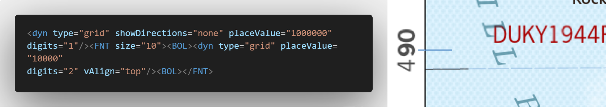
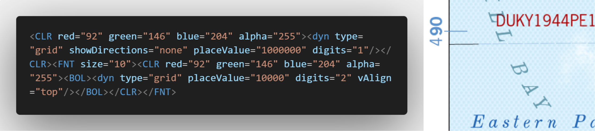
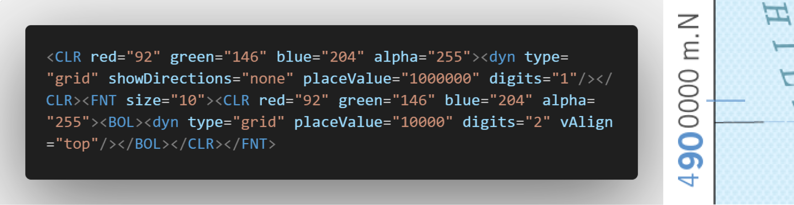
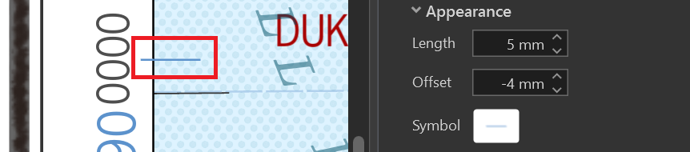

## Quick Summary

Measured grids are the sturdy framework that grounds spatial data in exactitude. In this article, we focus on complex grid labels, tick-mark placement, and the small styling decisions that help recreate the deliberate look of historical topographic maps in ArcGIS Pro.

## What You Will Learn

1) Build complex grid labels using multi-value formatting.

2) Fine-tune tick marks for subtle but impactful frame alignment.

3) Customise measured-grid styling to reproduce the authentic look of vintage topographic maps.

## Introduction

Welcome to Part II of this series on reviving historical map elements using ArcGIS Pro.

In [Part I](/articles/topo-grids-part-1), we explored the subtle art of corner coordinates and graticules, deciphering how every delicate line on a topo map carries purposeful cartographic intent.

Now, we turn to measured grids, the sturdy framework that grounds your spatial data in exactitude. Their styling, label placement, and tick-mark offsets are often overlooked. On historical maps, however, ticks are not shy or offset into irrelevance. They lean in proudly, carefully placed to achieve that timeless and deliberate look.

Measured grids help transform a map from a mere design into a finely engineered tool.

If you thought grid lines were just straight lines and numbers, surprise to you. This is where your map's true structure comes to life, and where the quiet work of grids takes centre stage.

In my case, I added intersection points for personal flair. They are not needed, but who said you cannot sprinkle in a signature touch?

## Complex Grid Labels

Let us call this Complex Grid Labels 101 because even the simplest-looking grids are secretly detail divas.

For the classic look:

1) The million's digit is small and top-aligned.

2) The hundred-thousand and ten-thousand digits are bold.

3) Colour differentiation, such as blue and grey, can add subtle emphasis without shouting. You can include it or leave it out.

> **Important**
>
> Work with the measured-grid label expression carefully. The order of the formatting tags controls which digits are reduced, emphasised, coloured, or retained as trailing zeros.

*Figure 1. Grid labels on the right with the value breakdown, unformatted colour, and truncated zeros. The dynamic text tag is shown on the left.*

The first figure shows the label structure before the full styling is applied. The dynamic text tag controls how the measured-grid values are separated, truncated, and positioned.

*Figure 2. Grid labels styled in blue with truncated zeros. The dynamic text tag is shown on the left.*

The blue treatment gives the key digits more presence while keeping the label restrained. The effect is subtle, but it helps the measured grid feel deliberate rather than automatically generated.

## Customising the Grid Labels

For my project, I customised the labels further:

1) Blue for the key digits.

2) Grey for the trailing zeros.

3) Optional bolding, although I think the labels breathe easier without the extra weight. Sometimes less is lighter, and your map margins will thank you for the whitespace workouts.

*Figure 3. Complex grid label with the styling discussed above implemented.*

This final result combines the value breakdown, colour differentiation, and truncated zeros into one measured-grid label. The label remains readable while still carrying the visual character of an older topographic map.

## Tick Marks' Big Impact

Tick marks often go unnoticed, but they play a critical role.

On historical maps, ticks are positioned slightly inside the map frame, just enough to feel intentional. In ArcGIS Pro, a tick length of about 5 mm works well, although you should experiment with other values based on the layout.

A small portion can peek outside, like a good introvert who is mostly in but not afraid to say hello. An offset of about -4 mm works well because most of the tick remains inside the margin.

> **Tip**
>
> Use a 5 mm length and -4 mm offset as a starting point, not a universal rule. Check the result at the final layout scale and adjust it against the neatline, margin, and surrounding labels.

An offset of -5 mm tucks the tick closer to the edge. It sits more than halfway inside but remains just shy of walking out, like it is eavesdropping on the map frame's secrets.

*Figure 4. Tick marks using a 5 mm length with a -4 mm offset.*

The final position should feel balanced against the neatline and surrounding map frame. The exact value can vary, but the principle remains the same: the tick should support the frame rather than compete with it.

## Final Thoughts

We all understand that everything good, even the tricky bits, must come to an end.

From bar scales to grids and graticules, every element in a topographic map tells a story. With ArcGIS Pro's dynamic text and grid styling, you can accurately revive these legacy designs while adding your own signature flair.

The beauty truly lies in the details. Sometimes it is the smallest lines that hold the biggest secrets, and a cartographer never reveals all their tricks at once.

Stay tuned. There is more map magic on the horizon.

Thank you!